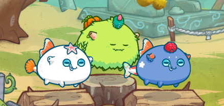
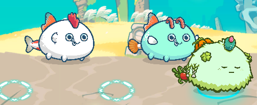
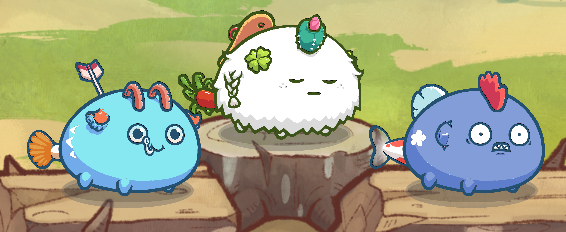
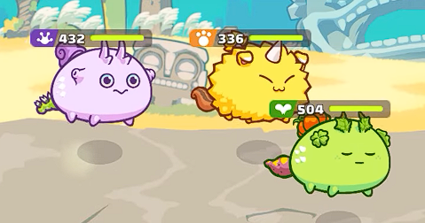
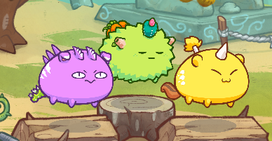

# Axie Infinity V2 Management Pro Tips!

Knowing who your scholars are is essential in managing an [Axie Infinity](https://axieinfinity.com/ "A Digital Nation") scholarship program because you will be entrusting them with your Axies. You trust that your investment wouldn’t go to waste simply because their playstyle does not match the Axies they were given. Some guilds prefer offering new scholars a few teams to choose from, ranging from Beginner, Intermediate, and Advanced. On the other hand, some would give them a specific budget and allow the scholar to build the team themselves. While this may sound ridiculous, sometimes, letting your scholars reach their fullest potential through a concept of their own may reward you in more ways than one.

To know your scholars, screening them before you onboard them into your program is a must. You could create a form with questions involving Axie Infinity with various difficulties to gauge their skill levels. This will determine the team tier you would be providing them. These are questions such as:
1. What combos should they do?  
2. What are the strengths and weaknesses of a particular team?  
3. How committed are they to playing?  
4. How can they defeat teams meant to be their own team’s counter?

Now for the teams, we can do thousands of combinations. Still, I will only provide you with what is "popular" or well-known enough that tutorials can be available on any social platform such as YouTube and Facebook. I will also be showing you the same team but with different difficulties.

### **Beginner:** AAP (Aqua, Aqua, Plant)

> - Plant: Hot Butt, Pumpkin, Cactus, Serious
> - Aqua 1: Nimo, Goldfish, Shoal Star, Risky Fish
> - Aqua 2: Koi, Goldfish, Oranda, Risky Fish
 
### **Intermediate:** AAP

> - Plant: Hot Butt, Pumpkin, Cactus, Serious
> - Aqua 1: Koi, Goldfish, Cuckoo, Risky Fish
> - Aqua 2: Nimo, Goldfish, Arco, Risky Fish
 
### **Advanced:** AAP

> - Plant: Hot Butt, Sandal, Cactus, Serious
> - Aqua 1: Nimo, Risky Arrow, Arco, Risky Fish
> - Aqua 2: Koi, Blue Moon, Cuckoo, Piranha
 
### **Beginner:** RBP (Reptile, Beast, Plant)

> - Plant: Yam, Pumpkin, Leaf Bug, Serious
> - Beast: Nut Cracker, Ronin, Imp, Nut Cracker
> - Reptile: Thorny Caterpillar, Snail Shell, Lagging, Tiny Turtle
 
### **Intermediate:** RBP

> - Plant: Yam, Pumpkin, Leaf Bug, Serious
> - Beast: Nut Cracker, Ronin, Imp, Nut Cracker
> - Reptile: Thorny Caterpillar, Tri Spikes
 
### **Advanced:** RBP

> - Plant (Dusk): Cattail, Sandal, Beech, Goda
> - Beast: Rice, Risky Arrow, Dual Blade, Goda
> - Reptile: Tiny Swing, Indian Star, Tiny Catapult, Kotaro

You always have the option to occasionally upgrade your scholar’s team, should they prove worthy of a more expensive team and if they are competent enough to hold a much more complicated one. Upgrades may also raise morale, as the game and token prices may cause some stress to scholars. However, this doesn’t mean spending more money. You may sell neglected teams just lying around, gathering dust, and use the revenue for upgrades.

There may come a time when your scholars will ask to test out other teams or try a different Axie with their current team. The simple task of retrieving and gifting Axies from one wallet to another could become tedious, especially with the repetitive process and the log-in of different accounts. It is also important to note that you could delegate this task but only to someone you **trust heavily**, as delicate information such as seed phrases or access to wallets can be dangerous to give out to anyone other than yourself. However, there are platforms, such as [Earn Management](https://app.earnalliance.com/ "Know your wallets!"), that can make your life much easier when it comes to managing your scholarship program, especially when you don’t have anyone you trust enough with such important information.

Throughout all the Axie changes and team upgrades, there comes the point where you will realize that lousy performance may not be the Axie team’s fault. Instead, it could be that the scholar holding it is not knowledgeable enough about the team, or he hasn’t adapted to its playstyle. A way to resolve this is through **coaching**. Coaching has proven to be a fun community activity as members of your scholarship could hang out in a [Discord](https://discord.com/ "Chat for Communities and Friends") call with someone live-streaming their gameplay; to educate or be educated. If this doesn’t happen naturally, then incentivizing players, or coaches, with an additional share from their students can be an option. Through [Earn Management](https://app.earnalliance.com/ "Track like a baws!"), calculating the additional fees for the work of coaches is no longer a problem with the automated payments installed in the software.

Besides coaching, creating a community whose collective goal is growth and helping each other explore the web3 space is optional but definitely highly rewarding. Gathering a select few into a group often referred to as a **council** could benefit the long run. These people, who have firsthand experience in Axie Infinity, could help you make tough decisions such as *budget spending, diversifying Axie teams, and scholar screening, especially* when problems arise if and when a scholar breaks the [Terms of Service](https://axieinfinity.com/terms/ "Axie Infinity’s Terms of Use").
