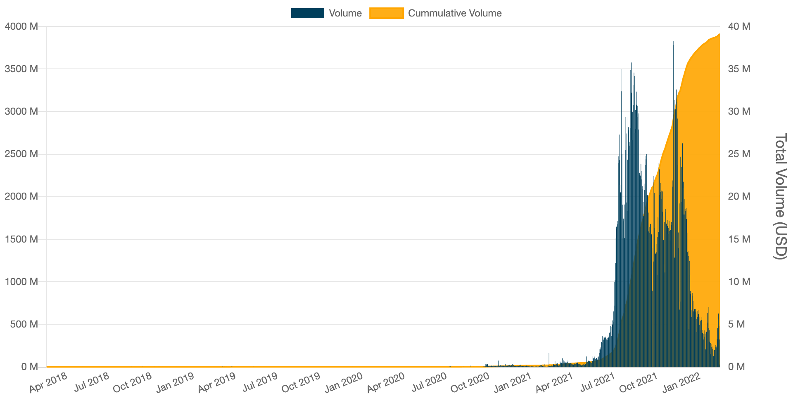
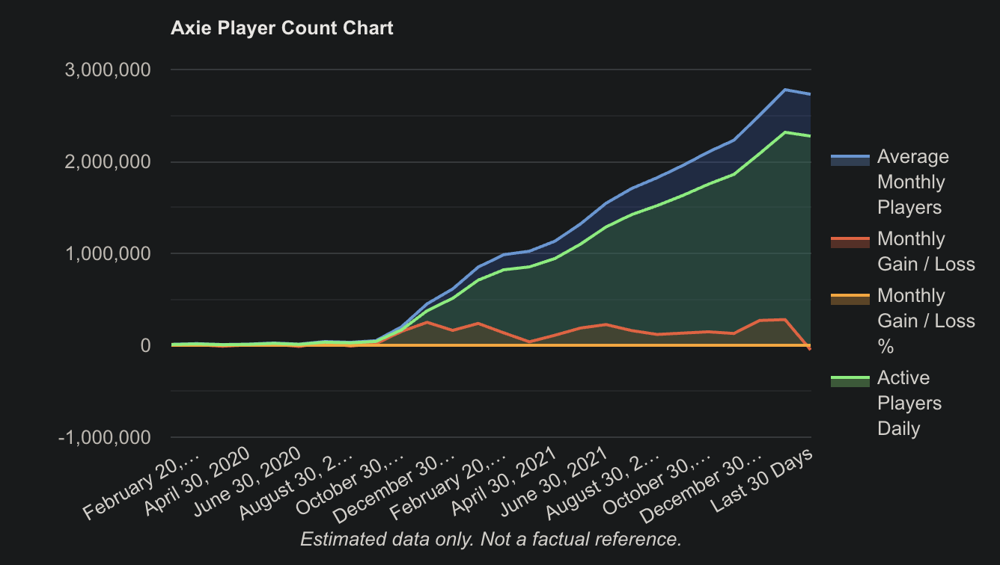
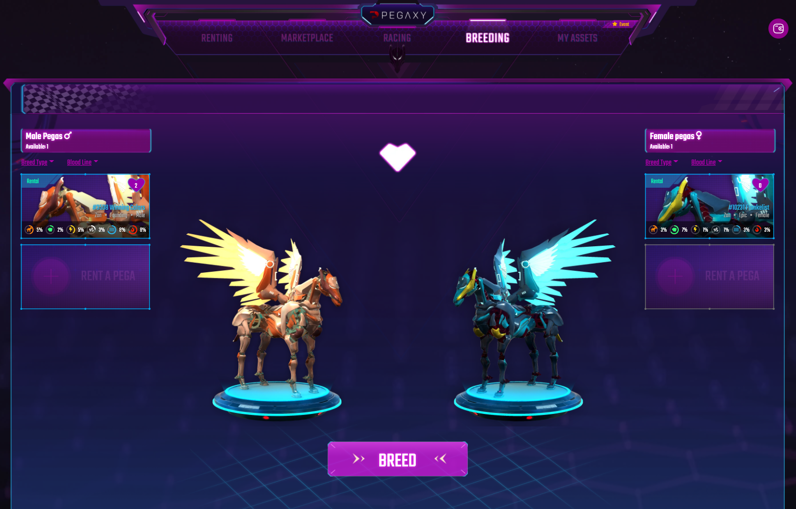

Last summer, Axie Infinity was all anybody was talking about. Here was this game filled with unique Pokemon-like pets, where players can be tangibly rewarded with real, hard-earned cash. Pair that with a pandemic; pair that with millions of people looking for alternative ways to make a living, and you have something of a magic formula.

In 2021, Axie Infinity's user base soared to 3 million daily players with nearly $4 billion in trading volume.

_Source: Axie World_

People are still talking about Axie Infinity today, but this time for a very different reason. The value of its NFTS and price of Smooth Love Potion (SLP) – its in-game currency – have since taken a nosedive.

In the course of 7 months, SLP **tumbled 97.5%** from an all-time-high of US$0.4 to US$0.009. That's not a tumble – that's what we call a _free fall_.

It's as terrifying as it sounds.

## Why did Axie Infinity crash?

The short and simple answer is: **far more SLP was being created than was being spent**. 4 times the amount of SLP was being generated every day in the form of in-game rewards than was being burned through breeding. People were cashing out 4 times as much than they were spending, resulting in hyperinflation of the currency and rendering it near worthless. 

And why was so much currency being created? Well, it blew up, first of all. In the year between September 2020 to September 2021, the monthly average players skyrocketed from 50,000 to nearly 2 million.

That's an **annual increase of 3,900%**.

_Source: activeplayer.io_

In any game economy or otherwise, rampant, unchecked growth is **ultimately unsustainable**.

The current game economy was simply not designed or built to support _this_ many people. But – is there a but? – it could have been worse. If there were, say, tens of millions of players wanting to play Axie Infinity all at once, the economy would have all but collapsed.

So I'm optimistic. Here are **3 reasons** why I believe it will remain relevant, or perhaps even _thrive_, in 2022 and beyond.

## We're still very early in the play-and-earn game space

The good news is, game economies, like anything else, are constantly evolving. We're now – all 4 million of us– floating around in a current, excited to see what happens next to Axie Infinity.

Play-and-earn game economies are just starting to be built. This version of Axie Infinity is only the _first iteration_ of that economy.

Hundreds of NFT games are currently being developed, and those expected to launch in the next few years will undoubtedly follow in Sky Mavis’ footsteps, all vying to become “the next Axie Infinity."

_Source: Pegaxy - Latest Play 2 Earn Craze in Q1 2022_

Having said this, what Axie Infinity decides to do next will be especially critical. At the time of writing, they’re expected to launch [Axie Infinity: Origin](https://axie.substack.com/p/origin?s=r "Axie Infinity: Origin") at the end of the month.

I wouldn't be at all surprised if Axie Infinity and the NFT games that crop up are completely different in the next 1, 5, 10 years.

What was experienced in 2021 is a mere teaser of what's to come. And if that's not something to look forward to, then I don't know what is. 

## Economic rebalancing is a priority

What I'm most excited about are the changes they'll implement later this year.

These modifications will **alter the way their economy works** and bring us to the next evolution of Axie Infinity.

In fact, on February 4th, Sky Mavis [announced its plans to rebalance the economy](https://axie.substack.com/p/upcoming-season-20-and-economic-balancing?s=r "announced its plans to rebalance the economy") from season 20 onwards. Its efforts primarily cover two things:

1. Reducing the overall issuance of SLP

2. Introducing a slew of burn mechanisms

> “In short, we think it’s critical to ensure that a healthy, predictable economy evolves over time and we take the responsibility of economic balance within Axie extremely seriously. We believe the fastest way to reduce this volatility is for us all to come to terms with our collective responsibilities within Axie, and quickly work to build consensus and enable each other’s community efforts. Prosperity amongst a community comes when it collectively creates more value than it consumes. 

> “On January 4th, we released a Dev Journal: Economic Balancing Post with three goals: to create a framework for community dialog around economic balancing, to prepare the community for upcoming economic changes, and most importantly to seek community input.” 

_– Axie Infinity, Feb 4 on Substack_

They don't pretend to have it all worked out. And in case you're wondering – that's a _good_ thing.

The community has started to outgrow the game. They're implementing economic changes as a temporary relief, but more importantly, they're listening to their community.

The execution, however, is contingent on whether they'll be able to hire strong engineers fast enough to keep up. 

## There are lots of applications for Axies 

The possibilities in the world of NFT and play-and-earn games are limitless. Beyond Axie Infinity, I imagine Axie NFTs could appear and be applied in other blockchain-based games. 

That is the wonder of the NFT games. They are truly games without borders. 

Whatever happens to the game, each Axie will undoubtedly retain some sort of unique commemorative value– a memento of the first successful play-to-earn NFT game, if nothing else. 

## Final Thoughts  

Yes, we're in a blizzard. Those who have been playing and benefitting from Axie Infinity in the last year – players, scholars, scholarship owners and investors alike – are nervous about its future, and they have every reason to be.
 
So far Sky Mavis has fulfilled their promises in 2021. I'm excited to see if they're going to meet expectations this year, especially with the reveal of Origin at the end of the month. 

To do so, I believe they'll need to source strong engineers that are better than they are, whether it's partnering or replacing themselves to move things a lot faster than they are today. 

Currently, the job descriptions don't look exceptionally strong for high-level engineers, and I think ultimately, it's really down to **execution tied to their engineering talent**. I'll start to worry if Axie doesn't look completely different in 2023.

I may not know what happens to Axie Infinity (don't worry, I'm still optimistic), but what I do know is this is only the very beginning of what is possible in the world of play-to/and-earn games. If you zoom all the way out, we've only just scratched the surface. 

We started Earn Alliance, and built Earn Management, our first tool, to empower play-and-earn gaming communities to thrive in this constantly-evolving ecosystem, beyond Axie Infinity, beyond any one game or phenomenon. 

There is much more terrain to explore, things to build, games to play and friends to be made. Check out our [roadmap](https://roadmap.earnalliance.com/ "roadmap") to see the plans we have in store, or [join us on Discord](https://discord.com/invite/GD65eQuVGz "join us on Discord") to be a part of our growing community.
