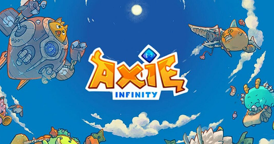
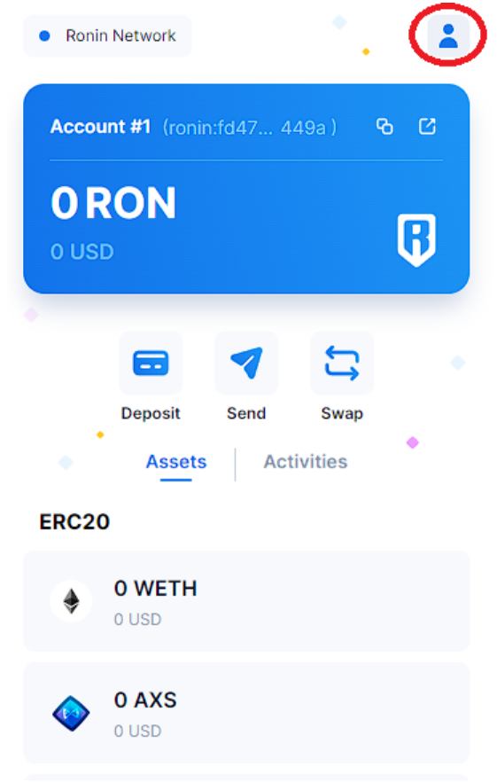
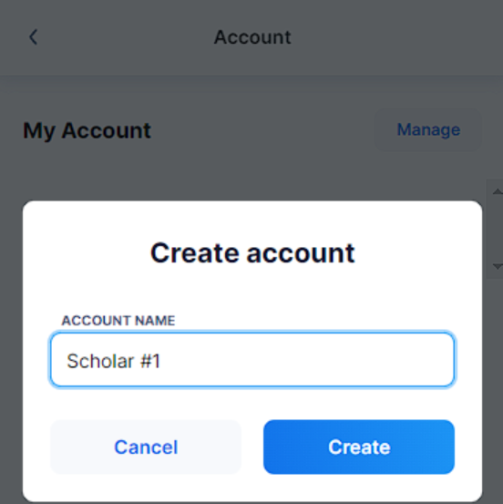

# Starting an Axie Infinity Scholarship Program

You’ve stumbled upon Axie Infinity and learned that it could be a great way to earn cryptocurrency, but did you know that you can also earn with Axies passively? Axie Infinity is a great introduction to Web3 as you will learn the full potential of NFT ownership with your own Axies.

Scholarships describe the practice of lending out Axies to other gamers and agreeing on a share of earned tokens. There are a few scenarios as to why you would want to start what’s called a scholarship program:

a) You have some Axies but realize that you have little to no time to continue playing the game yourself,
b) You love the game and want to give others access to the game through the Axies you own, or
c) You want to create a community where collectively playing, sharing strategy and earning is a goal

Whatever your reason may be, the steps to creating a scholarship program aren’t as complex as you might think.

First off, you should check out [Welcome to Axie Infinity (skymavis.com)](https://welcome.skymavis.com/) as it introduces you to the very basics including:

1. Creating a Wallet,
2. Buying Axies, and
3. Account Creation

Now that you have the basics set up, you might be itching to know what you need to do in order to lend your Axies to someone and set up a profit sharing system. The person who you lend your Axies to should be willing to play them for you for a share of the cryptocurrency earnings earned in the game (SLP and AXS). Any tokens earned will be given to you as the owner and payment to your scholar(s) will be your responsibility.

Creating a sub-wallet from your main wallet, to which you will transfer your Axies:

	1. Open your Ronin Wallet and click the upper right icon

	2. Click on Create Account, name it as you wish but it’s recommended that you keep organized from the get-go as up-sizing your program could become messy and tedious.

**Pro-tip:** storing your list of accounts and scholars as a CSV will be very helpful in the long term - use this [template](https://docs.google.com/spreadsheets/d/13jrVONAtcLZZ8S5gXGuV0_ccK19nMEeuQv7_GgUxYRo/edit#gid=0):

	3. Register your sub-account in the Axie Infinity Marketplace 	[Marketplace Dashboard (axieinfinity.com)](https://marketplace.axieinfinity.com/), for this you will need to create a new email account for your scholar and have to make sure to remember securely store the password alongside your accounts

Pro-tip: use an existing email with the format *existing+scholar1@earnalliance.com* as email protocol ignores anything from the “+” sign onward.

	4. Gift your Axies from your Main Wallet to your Sub-account Wallet

	5. Finally, give your scholar the email and password for the account they will be using and that’s it! Your scholar will just need to download the app then start playing.

That’s all you need to do to start your program! Scaling your scholarship up adds more management like listing who your scholars are, keeping their teams updated, keeping track of strong and poor performers and of course, an extended payment process.

This might make for tedious work but platforms such as Earn Management ([https://app.earnalliance.com/](https://app.earnalliance.com/)) have features like Axie build makers and automated payments that make life much easier.
