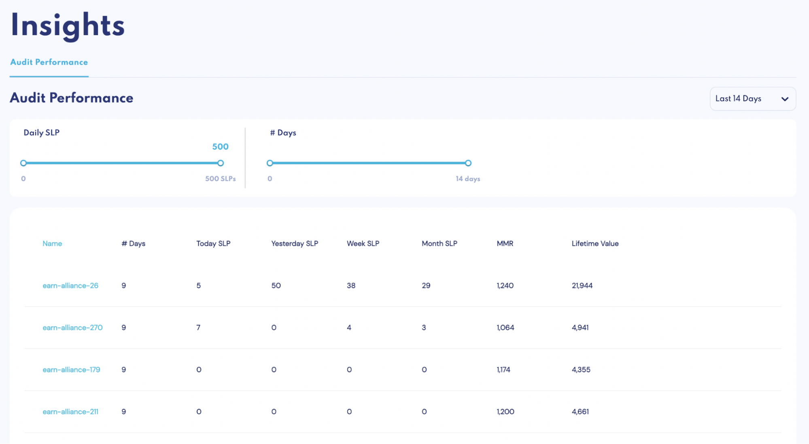
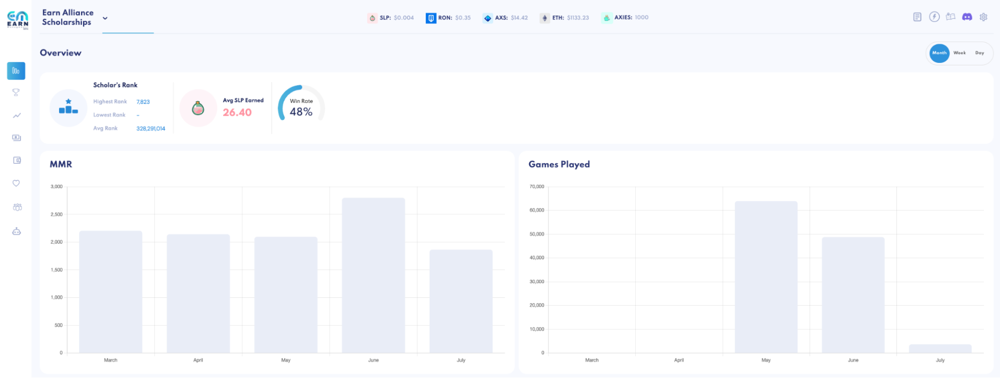
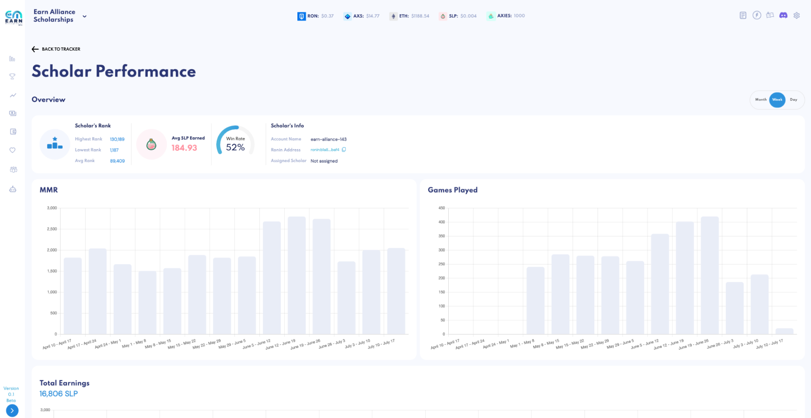
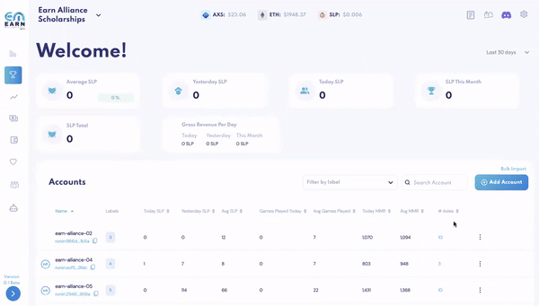
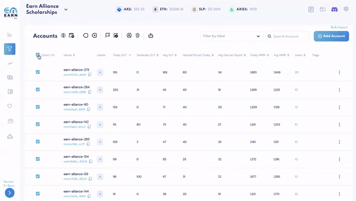

# Tracking Scholarships: Axies, SLP and Winrate? Make it easy

As an Axie Infinity Scholarship Manager, it’s a given that you would want to track how your players are doing with the Axie teams you have entrusted to them.

The critical data points you need to track are:

- SLP Earned per day
- Lifetime SLP
- Average SLP
- MMR
- Winrate
- Axies in Inventory
- Energy
- Leaderboard Ranking
- Claiming Date
- Scholar Ronin Address
- Account Ronin Address
- Guild Overall Performance

It seems excessive, yes, but these are essential for you to know if your scholarship program is doing well and if you have some internal or external adjustments to make. With these data in hand, you will see where problems might lie:

- Abandoned Accounts
- Weak Performing Players
- Poor Team Synergies

With these in mind, you can decide what course of action you will take according to the problem. Other than these persistent problems, you can also see which players deserve commending, rewards, or upgrades by gauging their:

- MMR
- Winrate
- Average SLP
- Leaderboard Ranking
- Energy

A simple Excel Sheet may suffice by manually keeping track of these, but there are trackers out there that automatically track them for you. However, why settle for a simple tracker when Earn Management can efficiently and effectively track everything for you? That's on top of being able to simplify dealing with problems that may arise, such as:

- Deleting an Account
- Changing Scholar Shares
- Payments
- Axie Gifting/Sending

All of which you can do in bulk! Earn Management has all of these features ready to go - [Scholar Tracker | Earn Management](https://www.google.com/url?q=https://www.earnalliance.com/&sa=D&source=editors&ust=1660660709630031&usg=AOvVaw2bpbEY4lq-TbcXiwZ-u5Zh)
