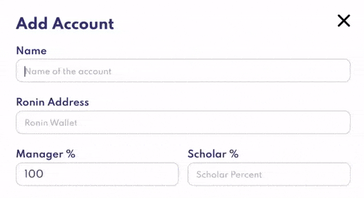
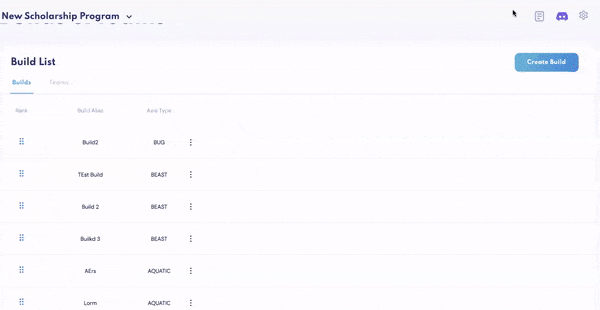

# Why it's hard to scale your scholarship program

You have finally gotten to building your scholarship program, whether on your own journey or after having read the tips in the [previous blog](https://www.earnalliance.com/blog/2022/07/20/Axie-Infinity-V2-Management-Pro-Tips/Axie-Infinity-V2-Management-Pro-Tips), you've succeeded in starting and now you are looking to scale your scholarship program. Still, you realise that repeating the same processes could take more time than you can offer.

There are plenty of issues other than the biggest one, **time**, especially if you have a competing responsibilities. In this instance, worrying about managing a scholarship program adds stress.

Managing a scholarship program means:

- Managing Accounts: saving account information such as emails and passwords while worrying about maintaining good security for each account.

- Managing People: everyone has different needs you cannot always guarantee you can attend to. You can have people manage them for you, but before all that, you will have to train them yourself to mirror your work if you are keen on consistency.

- Team Creation: considering how many different types of Axies there are, building a team could be complex, especially with the meta changing per season. You would want to make a long-lasting and versatile team to maximize ROI efficiency.

- Recruitment: it’s hard to choose from a vast quantity of people, especially if you are more of a *quality over quantity* kind of person, so other than filtering from possible multi-accounting players, you now must account for players that are well-experienced to not only meet but exceed your expectations.

- Monitoring Performance: having spent much time recruiting and building teams, it would be terrible to not serve each team justice by not being played properly if at all.

Surveying guild owners and scholarship program owners on the tasks above, the consensus on operation was to have a trusted group of people to deal with each task. But even then, in attempting to scale a scholarship program, it becomes difficult for each person to keep track of everything despite the divided workload.

This is why we built [Earn Management](https://app.earnalliance.com/) (https://app.earnalliance.com/)...

Why?

- Scholar Tracker: keep track of all your gamers, track all account performance levels, information, Ronin addresses (*of theirs, yours, and your trainer!*), and data tracking (*SLP gains, MMR, Unclaimed SLP, and number of Axies*).

- Bulk Payments: take hours of admin out of paying scholars, made simple as the app allows you to make bulk payments that automatically calculate after assigning their earning share, which can also be done in bulk!

- Builds and Teams: allow you to create templates of both an Axie build and Axie teams and automatically distribute them, which is especially important if you like having standardized teams.

*And more!* ([Overview | Earn Alliance](https://www.earnalliance.com/docs/introduction/overview))

Looking for more than what's available in **Earn Management**? With an active community and a devoted team, suggestions to improve the application are highly appreciated and actioned by the team at Earn Alliance.
