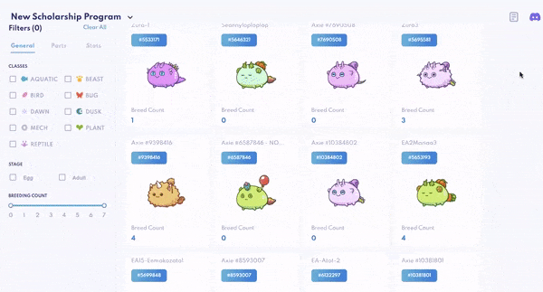
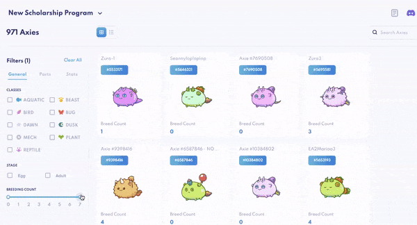
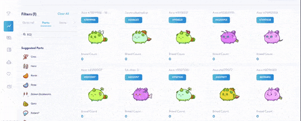
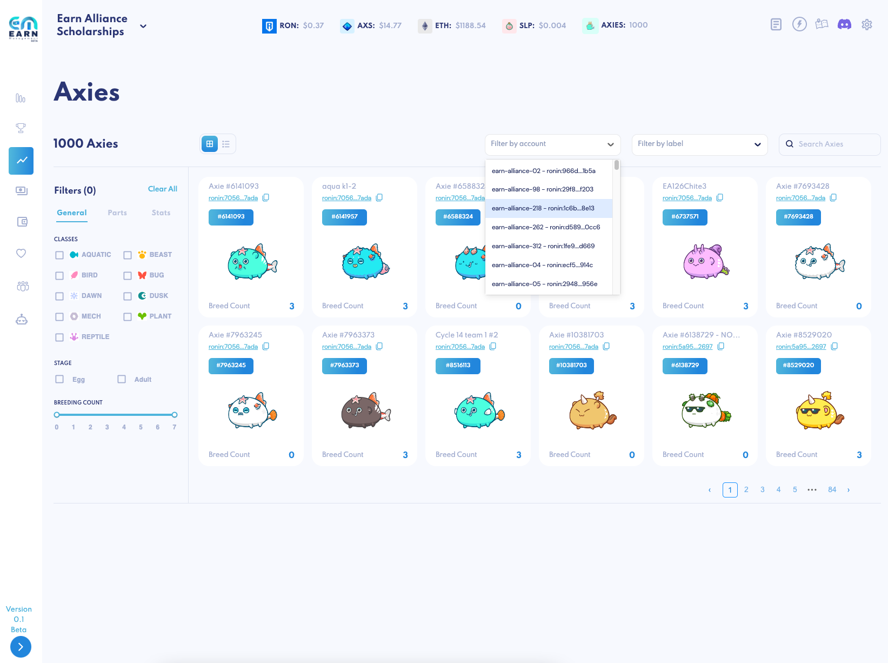

# Axies 

Our Axie dashboard gives you **a master overview of the Axies you own** across _all_ your tracked ronin wallets. Though you can also see any individual accounts' Axies from the [Tracker](tracker.md).

This is helpful because:

* While there are many available tools that show you every Axie’s gene composition, you can **quickly search for Axies by stats, parts or genes**, instead of clicking to view the Axies one by one or using excel sheets to organize.
* This is your **key to breeding**. If you know your metas and know exactly what Axies you need to breed, you can filter for a very specific group of high-quality Axies that match your meta.

For example, we are looking to breed Axies with:

* Breed count: 0
* R1 and R2 parts: Ronin, Imp, Nutcracker

The filter immediately gives us a masterview of all of our Axies that fit the bill, so to speak.

Using our advanced search, **filter your Axies** by:

1. Class
    * Aquatic
    * Beast
    * Bird
    * Bug
    * Dawn
    * Dusk
    * Mech
    * Plant
    * Reptile

2. Lifestage

3. Breed count

Adjust the toggle on both ends to select any range between 0 – 7 breed counts.

4. Parts

In the search field, enter the part you wish to search for. To select, click the desired part that appears in the column.

* To filter for dominant genes, leave R1 and R2 checkboxes blank.
* To filter for R1 _or_ R2 genes, select the respective checkboxes under each part.
* Selecting both R1 _and_ R2 genes for each part will filter for Axies with both R1 and R2 genes.
* To select multiple parts, enter in the search field and click into the part. Select as many parts as you’d like.

_Note: every search of multiple parts is a function of “and,” not “or.” For example, if you’re searching for two parts (i.e. Ronin and Imp), the Axies that appear share both Ronin and Imp parts._

5. Stats

Adjust the toggle on both ends to select any range for Health, Speed, Skill and Morale.

After filtering your Axies, you’ll be able to see them by selecting the **gallery or list view**.

Select “Clear All” on the left to **reset your search**.

### Filter Axies by Account(s) and Label(s)

To view Axies from specific account(s) or label(s) only, use the filters on the top to select individual or multiple accounts and labels.

### Send Axies 

To **transfer Axies to scholar accounts directly from your Axies dashboard**, make sure you've installed the latest version of [Wallet Commander](wallet-commander.md). 

If you've installed the Wallet Commander for the first time, open up the Wallet Commander and enter the transfer command by copying it directly from the Axie page.

To start an Axie transfer, **click on the little blue arrow at the top right of the Axie card**. Search for / select the account you're wanting to send the Axie to in the dropdown. 

If you don't have a specific target wallet in mind, use the quick filters to curate wallets with 0 Axies in them, and/or wallets that are not assigned to scholars.

If all goes to plan, a success message will appear at the top right. And that's Axie sending, done and done! 

