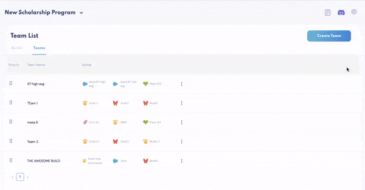
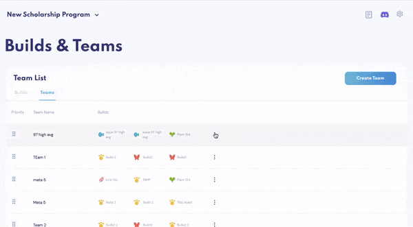

# Builds & Teams

Our Builds & Teams feature allows you to create your Axie Build preset, and to create meta team presets consisting of your Builds. In a single click, you’ll be able to **automatically generate and distribute teams** according to those conditions.

## Build Templates
To **create a build**, click into “Create Build” on the top right.

1. First, give your Axie build a name
2. Select the class under “Axie Type”
3. _Optionally_ choose as many genes for each Axie body part

To **create a general Axie build template** of a class (i.e. beast) with no specific parts in mind, simply choose the Axie Type and leave all parts blank.

To create a “Backdoor Bird” build by selecting the following characteristics in the drop-down menu under each relevant part:

* Kestrel horns
* Hare eyes
* Little owl mouth
* Cupid back
* All bird parts eyes
* All bird parts ears

Easily **edit or delete each build** (on the right), or **drag them up and down** and rank them according to priority (on the left). Priority _does not have a utility yet, and is simply used for organization_.

Now that you’ve created your builds, it’s time to **create your first team template**.

If you know which team combinations work, go ahead and enter a name for your team preset, and select 3 Axie builds for the team.  

When you’re done building your desired teams, they’ll all appear under “Teams.” Again, like the Builds, you can edit, delete, or drag to rank.

## Team Templates

The next step is to match all of your Axies into teams according to your Team presets.

Below, you’ll see this scholarship has automatically distributed their Axies into 538 teams, according to their meta – beast, aqua and plant. In one click, 1,614 beast, aqua and plant Axies were sent to 538 ronin wallets– a task that would’ve otherwise taken hours.

Any remaining **Axies that don’t fit the Team template** will be unmatched, the total of which you’ll see under “Unmatched Axies.”

To **send teams to empty wallets**, click “Distribute Teams,” which will automatically dispense every team of matched Axies into an empty wallet.

If you see a number of Axies in “Matched Axies With No Available Wallets,” it means these **teams have been matched, but there are no empty wallets** for them to go into. To add an empty wallet, head to Wallet and add an empty one.

Like payments, select [Wallet Commander](wallet-commander.md) from the Settings menu to watch the **team distribution updated on the blockchain in real time**. Et voilà!  
