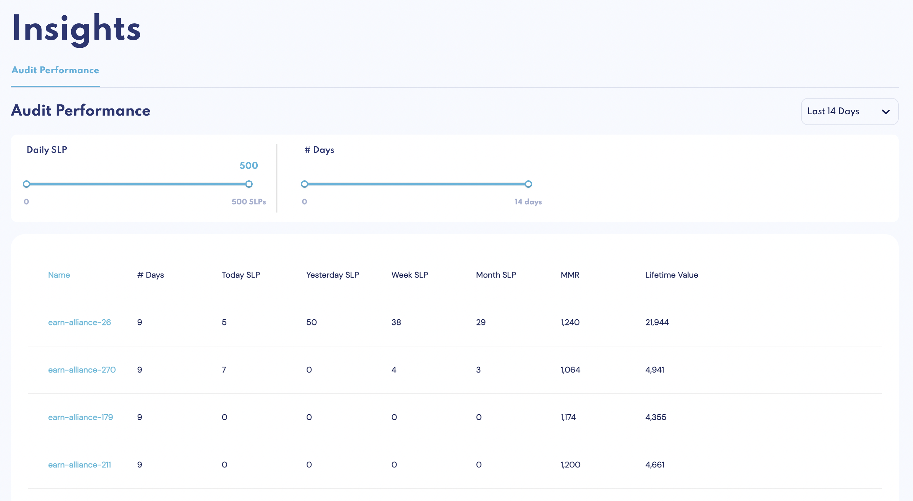
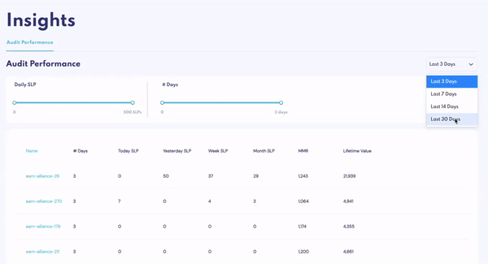
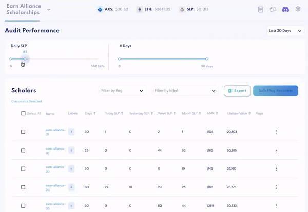
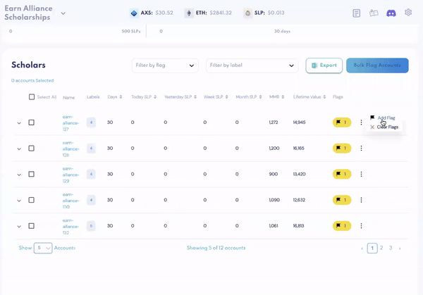
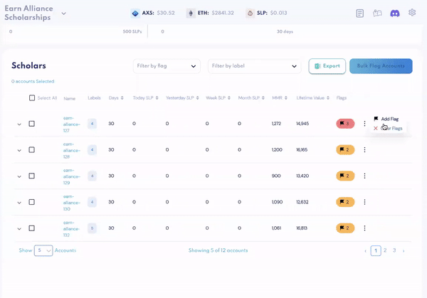
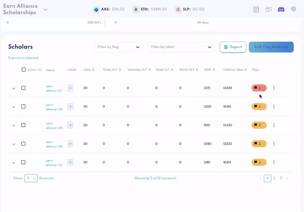
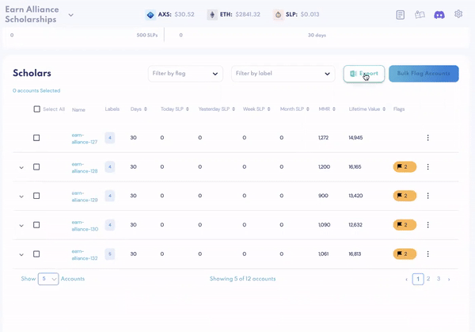
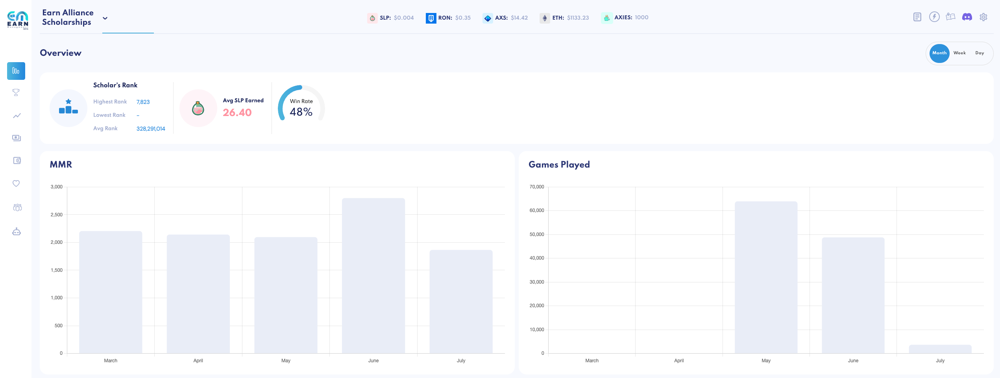
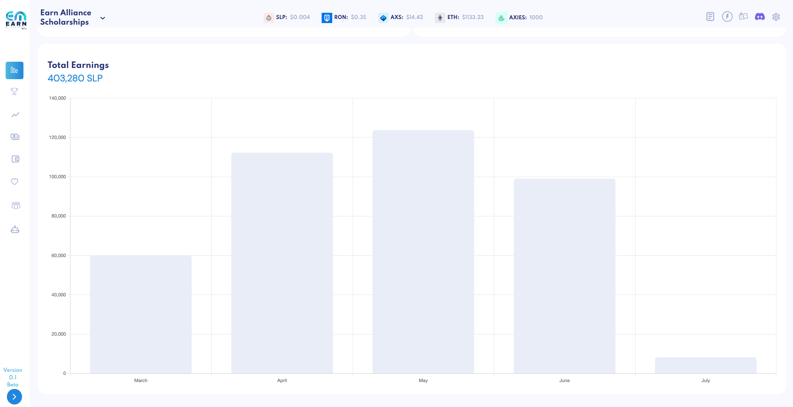

# Insights  

The Insights feature is designed to help scholarship managers easily and efficiently monitor their scholars' and guild's performance, whether it is by:
* Auditing a scholar's performance by filtering and flagging based on SLP earned
* Getting an overview of your guild's earnings and games played across days, weeks or months
* Understanding which Axie team brings home the most earnings - no guesswork involved!  

_Note: All data in Insights starts tracking from the moment you've imported your accounts; you will not be able to immediately retrieve any data from this feature. If you're new to Earn Management, check back in 24 hours!_  

### Audit Performance

Audit Performance allows you to **quickly audit your scholars’ performance** and **immediately identify consistently high-performing, under-performing or inactive accounts**. 

You can do this using 3 filters:

1. Date range: Select the last 3, 7, 14, or 30 days 
2. Daily SLP: Select the amount/range of SLP a scholar has earned per day OR Daily Games: Select the number/range of games a scholar has played per day
3. Number of Days: Select the  # of days the scholar has earned the selected range of SLP / played the selected range of games

The accounts that meet the selected criteria will appear below. For each account, you'll be able to see: 

* The # of days it logged x amount or range of daily SLP or daily games
* Today's Games Played
* Week's Games Played
* Today’s SLP 
* Week SLP: Total SLP this week 
* MMR/Rank
* Lifetime value  

#### Inactive Accounts 

The best use case of this feature is **screening for accounts that have not been active**. 

For example: You'd like to vet for inactive accounts that have logged 0 SLP for 3 days within the last 3 days.

1. Select “Last 3 Days” for time frame 
2. On the “Daily SLP” slider, drag it to 0 
3. On the “# Days” slider, drag it to 3 days

You will see below that in this scholarship, 98 accounts have registered 0 SLP every day for the last 3 days. 

#### Flag Accounts

After generating a list of accounts you're interested in, you are able to flag all accounts at once by clicking Select All and Bulk Flag Accounts. 

Or flag accounts individually using the action menu on the right.  

Each time you flag an account, you have the option of adding a note. Expand each account to view its note log.  

In the action menu, you can also clear all the flags associated with an account. This is especially helpful if a new scholar has started playing on that account and a reset is needed. 

Note that accounts can have a maximum of 3 flags. Any attempt to add any additional flags will result in an error message. 

Click Export to download all data. 

Beyond the day-to-day account tracking, the Insights feature gives you a high-level, big-picture view of which - and the number of - accounts that are performing in a specific catergory, and allows you to organize your monitoring process in a systematic way.  

### Guild Performance 

In addition to tracking how individual scholars' performance, you can also get an **overview of your guild's health** in Guild Performance. 

Switch between Month, Week and Day views to view:
* Scholars' highest, lowest and average rank
* Average SLP earned 
* Win rate
* Average MMR  
* Total games played 
* Total Earnings  

### Axie Teams

In the Axie Teams tab, you'll be able to see your guild's **Axie teams ranked from highest-performing to lowest-performing**, according to SLP earned. Expand each row to quickly see which of your accounts are using these teams, and what order they have their Axies in. 

