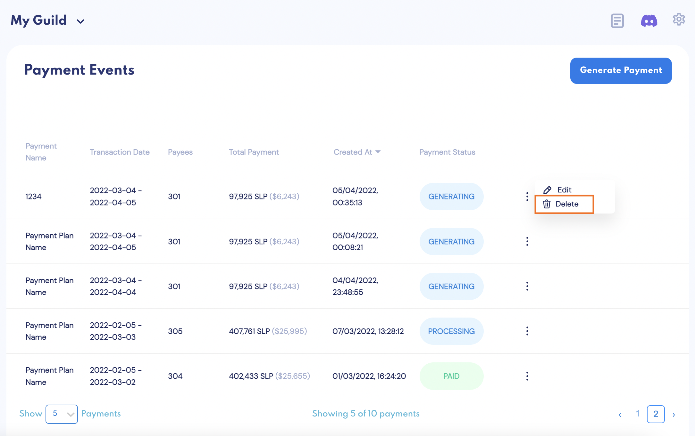

# Payments

One of the most time-consuming and error-prone tasks when running an Axie scholarship is processing **accurate, transparent, secure and detailed payments**.

With this feature, whether you have 10 or 1,000 scholars, you will be able to **process batch payments with a few clicks**.

If you decide to invite your [scholars via email](user-management.md#invite-user-from-user-management), they can also view historic individual payments and the breakdown of how they were paid. Scholars invited have **read-only access to your account**.

### Generate Payments

1. To **generate a Payment Event**, click “Generate Payments.”

2. Select your payment start and earn date, and “Generate.”

Note that when choosing a date range, it only picks up scholars _based on their last paid day_.

For example:

* If the scholar was last paid today, there would be no payment to generate.
* If the scholar was last paid on Nov 1, 2021, it will generate a payment for the scholar’s earnings between Nov 1, 2021 and today.

3. For every **Payment Event**, you will see:

    * Transaction date _(start to end_)
    * How many scholars are eligible to be paid
    * Total payment amount
    * Payment status

4. You can always **delete a Payment Event** using the action menu on the right.

5. Click into the payment to see **Payment Details**.
    * Start and end date
    * Scholar name and ronin address
    * When the scholar was last paid
    * Scholar, manager and trainer SLP amount
    * Total SLP earned
    * Payment status

6. To **double-check total SLP earned**, click on the ronin address to view all transactions associated with that wallet.

7. Click on the action menu on the right to **edit the scholar or skip this account for this Payment Event**.

8. **Expand each Payment Event** by clicking on the arrow on the left, which will show you something of an itemized invoice. You will see who and how much each person gets paid, usually the scholar, manager and trainer, if any.

9. Before starting payments, if you wish to **modify any payment**, click “Add More,” where you can edit by adding or subtracting SLP. This is useful for any bonuses, deductions, previous errors in payment, and more. After making any modification, click “Regenerate” to refresh the page. This should take a few seconds.

### Start Payments

1. Before you Start Payments, the **Payment Event generation process must be complete**. Refer to the progress bar at the top to track its progress. The “Start Payments” button will be disabled until the Payment Event is ready. 

2. When the Payment Event is ready, you can **view each payment’s status**. 

    * Generating
    * Processing
    * Pending Claim
    * Skip
    * Error
    * Paid
    * Unpaid

3. All payments with a Pending Claim or Error status **must be resolved** before payments can be started. If you attempt to Start Payments with unresolved issues, a warning message will appear. 

4. To resolve any accounts with Pending Claims and/or Errors, **use the payment status dropdown filter** to generate a list of accounts.

5. When you are ready to **pay your scholars**, click “Start Payments." To watch the payouts occur, select [Wallet Commander](wallet-commander.md) under the Settings icon at the top right. Here, you will see the transaction being updated on the blockchain in real time.

And that’s payments done and dusted – sans messy excel sheets, SLP confusions, over- and under-paying scholars every month.
