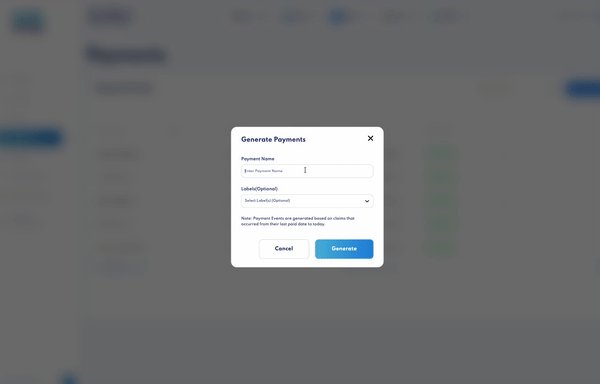

# Payments

One of the most time-consuming and error-prone tasks when running an Axie scholarship is processing **accurate, transparent, secure and detailed payments**. With this feature, whether you have 10 or 1,000 scholars, you will be able to **process batch payments with a few clicks**.

If you decide to invite your [scholars via email](user-management.md#invite-user-from-user-management), they can also view historic individual payments and the breakdown of how they were paid. Scholars invited have **read-only access to your account**.

By default, the guild's account is the wallet you've set as the treasury, which can be set or changed in [Wallets](wallets.md). All guild payments will be transferred to this treasury account. 

Before you start Payments, **you must have [Wallet Commander](wallet-commander.md) installed**. 

### Generate Payments

1. To **generate a Payment Event**, click “Generate Payments.”

_Note: Payment Events are generated based on claims that occurred from their last paid date to today. 

2. To pay only a select group of scholars, select label(s). 

3. For every **Payment Event**, you will see:

    * Transaction date _(start to end_)
    * How many scholars are eligible to be paid
    * Total payment amount
    * Payment status

4. You can **delete a Payment Event** using the action menu on the right when the payment status is Not Paid. When the payment event is Generating, Processing or Paid, the event cannot be deleted.

5. Click into the payment to see **Payment Details**.
    * Start and end date
    * Scholar name and ronin address
    * When the scholar was last paid
    * Scholar, guild and trainer SLP amount
    * Total SLP earned
    * Payment status

6. To **double-check total SLP earned**, click on the ronin address to view all transactions associated with that wallet.

7. Click on the action menu on the right to **edit the scholar or skip a payment for this Payment Event**.

8. **Expand each Payment Event** by clicking on the arrow on the left, which will show you something of an itemized invoice breakdown. You will see who and how much each person gets paid, usually the scholar, guild and trainer, if any.

9. Before starting payments, if you wish to **modify any payment**, click “Add More,” where you can edit by adding or subtracting SLP. This is useful for any bonuses, deductions, previous errors in payment, and more. After making any modification, click “Regenerate” to refresh the page. This should take a few seconds.

### Start Payments

1. Before you Start Payments, the **Payment Event generation process must be complete**. Refer to the progress bar at the top to track its progress. The “Start Payments” button will be disabled until the Payment Event is ready. 

2. When the Payment Event is ready, you can **view each payment’s status**. 

    * Generating 
    * Processing - pending payment 
    * Pending Claim
    * Skip
    * Error
    * Paid
    * Unpaid

3. When you are ready to **pay your scholars**, click “Start Claims and Payments." Wallet Commander events will be generated and each payment will be updated live on this page. You may also watch the generated payouts wallet commands get executed by selecting Wallet Commander under Settings at the top right. Here, you will see the transaction being updated on the blockchain in real time.

And that’s payments done and dusted – sans messy excel sheets, SLP confusions, over- and under-paying scholars every month.
