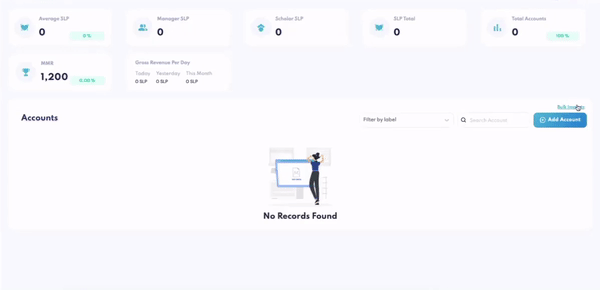
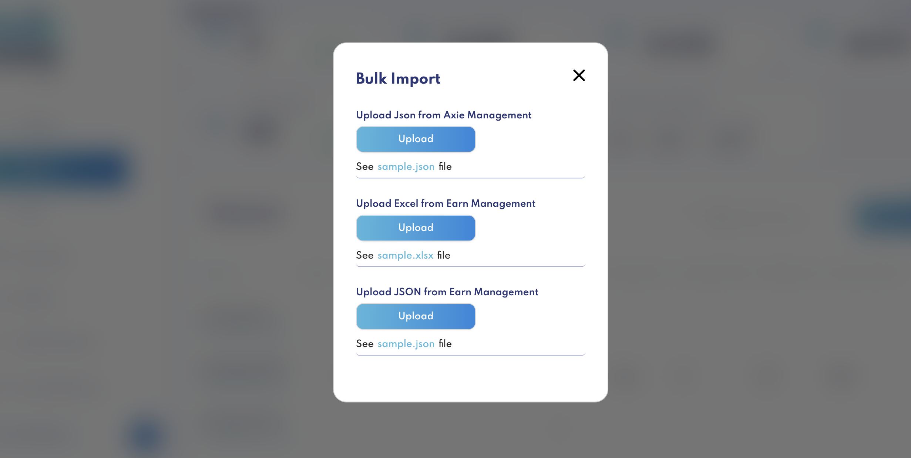
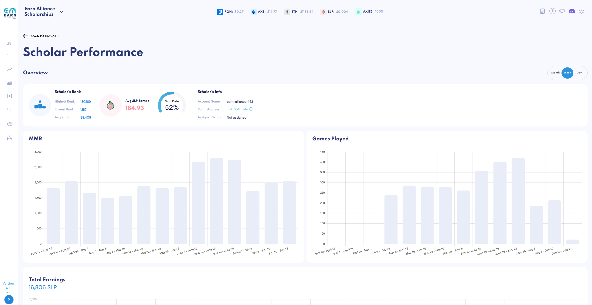
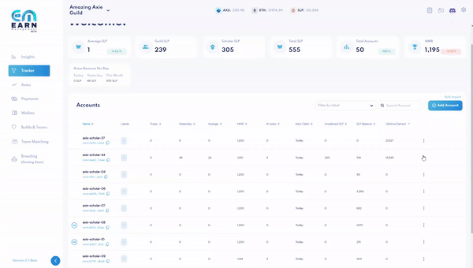
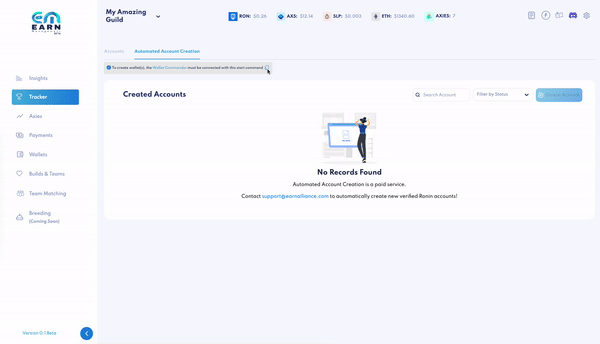
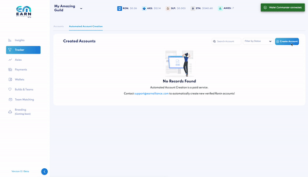
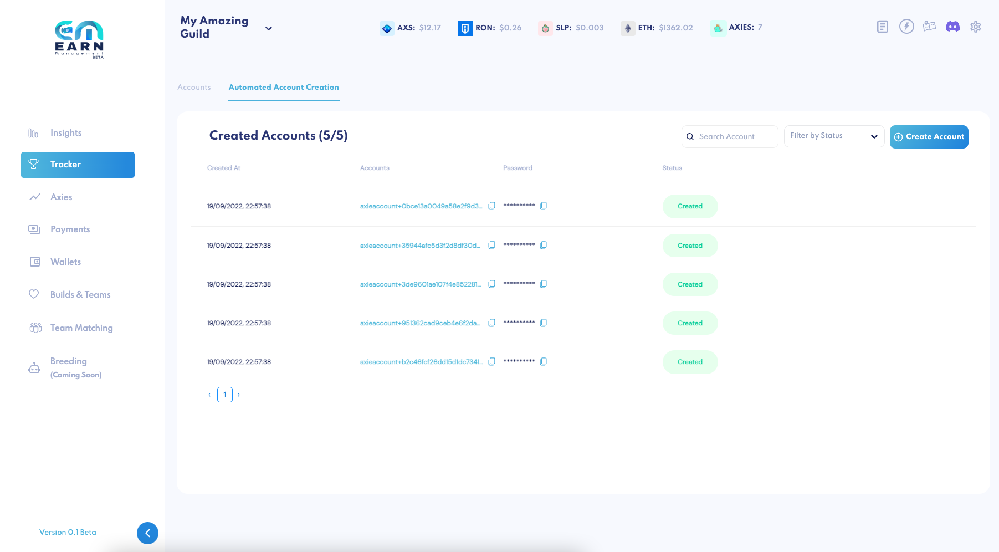

# Scholar Tracker

Our tracker is used to **monitor your accounts** associated with the ronin addresses used to play Axie Infinity.

That enables our system to **track the scholars’ performances** and their **wallets’ earnings** over time. Additional information, such as historical earnings and Axies, can be tracked as well.

### Add Account

[Bulk import accounts](tracker.md#bulk-import) or manually **add each scholar’s account** by filling in the following information:

1. Account name _(i.e. scholar-01)_
2. Ronin address _(this is the account your scholar plays on)_
3. Scholar’s % revenue share

After entering your scholar’s %, the guild’s % revenue share will be automatically updated to equal 100%.


**Account Optional field**

**The following fields are optional for accounts.**

4. Scholar’s payment ronin address _(this is the account your scholar is paid in)_

Directly enter your scholar’s payment ronin address, or if that’s not available, **adjust the toggle** on the right to use the scholar’s email address.

You can either:

- Enter the scholar’s email address
  - If they don’t already have an Earn Management account [invite them via email](user-management.md#invite-user-from-tracker) in the same field.


Note that **to** **use our [Payments](payments.md) feature,** your scholar’s payment ronin address must be entered.

5. Label(s)

Labels are used to organize your accounts for quick search and filtering capabilities.

Enter as many tags as you wish to help you quickly filter and organize your scholars, such as:

- GUILD-1
- TEAM-BLUE
- NINJA-SQUAD


6. Trainer’s ronin address

This can be a trainer, mentor or investor that gets a revenue share off this scholar.

7. Trainer’s % revenue share

The guild, scholar and trainer’s % revenue share will automatically add up to 100%. This share percentage will be deducted from the guild’s share pool.

8. Last paid date

Enter the last date the scholar was paid. By leaving it blank, it will default to today’s date.

**You’re now tracking your first scholar’s ronin wallet!**

### Bulk Import

Rather than add accounts one-by-one manually, you can choose to **bulk import all scholars’ accounts** by uploading a `.json` or Excel file.

1. If you currently use [Axie Management](https://axie.management), you may export your data in a `.json` file and directly import it into Earn Management.

You can also find the following format here:

```
    {
        "managerShare": 50,
        "eth": "ronin:xxxxxxxxxxxxxxxxxxxxxxxxxxxxxxxxxxxxxxxxxxxxxx",
        "name": "name-of-the-account",
        "scholarPayoutAddress": "ronin:yyyyyyyyyyyyyyyyyyyyyyyyyyyyyyyyyyyy",
        "investorPercentage": 0,
        "investorRonin": ""
    }
```

2. If you don’t currently use Axie Management, upload a `.json` file with the following format:

```
    {
        "alias": "ea-account-01",
        "ronin_wallet": "ronin:ab673081b96b53ed7de9f87c5256212c2dbc016e",
        "scholar_share": 55,
        "scholar_payment_ronin_wallet": "ronin:9989c845f4bf7930707734cb257ccc6b66e94220",
        "trainer_share": 2,
        "trainer_payment_ronin_wallet": "ronin:9989c845f4bf7930707734cb257ccc6b66e94220",
        "last_pay_date": "2022-02-15"
    }
```

3. Using Excel? Here's a [demo template](https://docs.google.com/spreadsheets/d/1RqtQKuyx5ZjDDd0tOR6gDnNrzkn7NlYU/edit?usp=sharing&ouid=115387068804829440568&rtpof=true&sd=true).

#### How to Import

Select "Bulk Import" by clicking above the "Add Account" button



Upload your `.json` or Excel file



View your newly imported accounts!

_Note: While duplicate payment wallets are allowed, gameplay wallets cannot be duplicated on the tracker. If you attempt to import a file with duplicate account wallets, an error message will occur._

### Tracked Data

With each account added, you’ll be able to **access the following data**:

- Labels
- Today SLP
- Yesterday SLP
- Average SLP
- Games Played Today _(total games played in a 24-hour-period yesterday)_
- Average Games Played _(average daily games played)_
- Total MMR
- Average MMR
- Unclaimed SLP _(amount of SLP since last claim)_
- Number of Axies

### Sort Accounts

The sort function allows you to easily **identify your highest and lowest performing accounts**, and whether scholars in the latter category may need training.

Utilizing this data will help you make decisions in building an even more successful scholarship.

**Search for accounts** easily by using the label filter or account name.

### View Accounts' Axies

Easily view any account's Axies by selecting the # Axies in each account row.


### View Scholar's Performance Over Time

Get an overview of any scholar's performance by clicking anywhere on the account row or from the action menu on the right. You'll be able to see how the scholar's performed over time by month, week or days.

- Highest, lowest and average rank
- Average SLP earned
- Win rate
- MMR
- Games played
- Total earnings



### Flag Accounts

Flag accounts using the action menu on the right.

Each time you flag an account, you have the option of adding a note. Expand each account to view its note log.

In the action menu, you can also clear all the flags associated with an account. This is especially helpful if a new scholar has started playing on that account and a reset is needed.


_Note: accounts can have a maximum of 3 flags. Any attempt to add any additional flags will result in an error message._

### Unassign Accounts

When a scholar is no longer playing on an account, **you can temporarily unassign an account** instead of deleting it from the tracker.

Select "Unassign" from the action menu located on the far right of each account row. When an account is unassigned, all information attached to the scholar will be automatically removed.

This includes:

- Scholar payment address
- Scholar email
- Trainer payment address
- Last paid date



### Bulk Edit Accounts

Perform the following actions in bulk by selecting one or more (or all) account(s).

- Change scholar, guild and trainer % share
- Change scholar's last paid date
- Add label(s)
- Clear all labels
- Add flag and corresponding note
- Clear all flags
- Unassign
- Delete
- Export

Selecting any one account will prompt action icons to appear.


### Automated Account Creation 

Onboarding scholars to an Axie Infinity guild can be tedious, as guild managers must manually create ronin wallets and go through an email verification process for each new scholar. For large guild users trying to scale by thousands of scholars at a time, this is not sustainable. We offer a way for guilds to automate the wallet creation & email verification process at the click of a button. 

As this is a paid feature, you must first contact support@earnalliance.com to request access. You will be given a number of credits to create a certain number of wallets. 

1. Connect [Wallet Commander](wallet-commander.md) with start command, which you can copy directly from the page 
2. Specify how many wallets you'd like to create 



As this is manually initiated by an engineer, the wallets will not be created immediately. As you are waiting for the wallets to be created, you'll be able to see the following information: 

* Created At (date, time) 
* Email 
* Password (hidden for privacy; copy and paste to view)
* Status: Pending, Processing, Created 



When the wallets have been created, you'll see the screen below. Simply copy the passwords to distribute to your new scholars! 




### How We Track Data

All data is synced on our servers every 3 hours using an API that speaks directly to Axie Infinity's servers.
