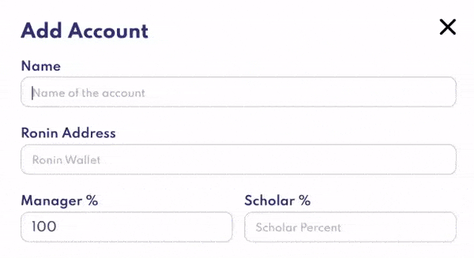
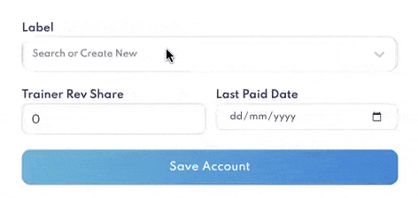
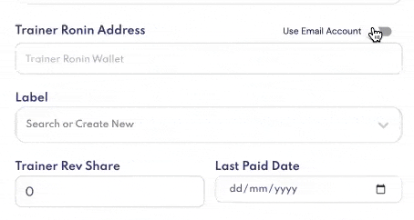

# Scholar Tracker

Our tracker is used to **monitor your accounts** associated with the ronin addresses used to play Axie Infinity.

That enables our system to **track the scholars’ performances** and their **wallets’ earnings** over time. Additional information, such as historical earnings and Axies, can be tracked as well.

### Add Account

[Bulk import accounts](tracker.md#bulk-import) or manually **add each scholar’s account** by filling in the following information:

1. Account name _(i.e. scholar-01)_
2. Ronin address _(this is the account your scholar plays on)_
3. Scholar’s % revenue share

After entering your scholar’s %, the manager’s % revenue share will be automatically updated to equal 100%.

**Account Optional field**

**The following fields are optional for accounts.**

4. Scholar’s payment ronin address _(this is the account your scholar is paid in)_

Directly enter your scholar’s payment ronin address, or if that’s not available, **adjust the toggle** on the right to use the scholar’s email address.

You can either:

* Enter the scholar’s email address 
    * If they don’t already have an Earn Management account [invite them via email](user-management.md#invite-user-from-tracker) in the same field.

Note that **to** **use our [Payments](payments.md) feature,** your scholar’s payment ronin address must be entered.

5. Label(s)

Labels are used to organize your accounts for quick search and filtering capabilities.

Enter as many tags as you wish to help you quickly filter and organize your scholars, such as:

* GUILD-1
* TEAM-BLUE
* NINJA-SQUAD

6. Trainer’s ronin address

This can be a mentor or investor that gets a revenue share off this scholar.

Again, if the payment address is not available, adjust the toggle to enter the trainer’s email address instead.

7. Trainer’s % revenue share

The manager, scholar and trainer’s % revenue share will automatically add up to 100%. This share percentage will be deducted from the manager’s share pool.

8. Last paid date

Enter the last date the scholar was paid. By leaving it blank, it will default to today’s date.

**You’re now tracking your first scholar’s ronin wallet!**

### Bulk Import

Rather than add accounts one-by-one manually, you can choose to **bulk import all scholars' accounts** by uploading a `.json` file.

The `.json` file format is the same as that of [Axie Management](https://axie.management). You may export your data and directly import it into Earn Alliance.

**The format is the following:**

`{TODO: Get format}`

**Using an Excel file?**

Here's a [demo template](TODO xxx). 
Convert to `.json` with [this converter](https://products.aspose.app/cells/conversion/excel-to-json)

#### How to import

1. Select "Bulk Import" by clicking above the "Add Account" button

2. Select your `.json` file and click upload

3. View your newly imported accounts!

_Note: Accounts cannot be duplicated on the tracker. If you attempt to import a file with duplicate accounts, an error message will occur._

### Tracked Data

With each account added, you’ll be able to **access the following data**:

* Average SLP _(average of all tracked scholars across last 30 days)_
* Manager SLP _(total for last 30 days)_
* Scholar SLP _(total for last 30 days)_
* Trainer SLP _(total for last 30 days)_
* Total SLP _(total manager + scholar + trainer SLP for last 30 days)_
* Total Scholars Tracked

* MMR 

* Gross Revenue _(today, yesterday, this month)_

### Sort Accounts

The sort function allows you to easily** identify your highest and lowest performing accounts**, and whether scholars in the latter category may need training.

Utilizing this data will help you make decisions in building an even more successful scholarship.

**Search for accounts** easily by using the label filter or account name.

Or **sort your tracked accounts** by any of the following metrics:

* Today _(SLP)_
* Yesterday _(SLP)_
* Average _(SLP/past 30 days)_
* Win Rate
* Number of Axies per account 
* Next Claim _(days remaining until next payment)_
* Unclaimed SLP
* SLP Balance _(what’s in the scholar’s wallet)_
* SLP Total _(total unclaimed SLP and SLP balance)_
