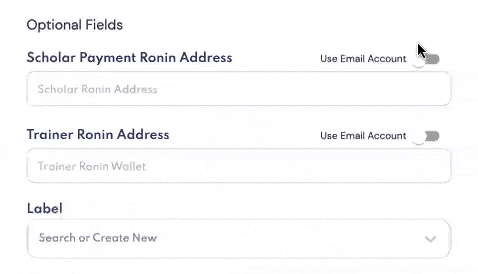

# User Management

2 types of users can be **invited to create Earn Management accounts via email.**

1. Admins who have accounts can manage and access all features of the account.
2. Scholars who have accounts can view:
   * Individual activity and performance 
   * Historic payments and breakdowns of how they got paid
   * Note that scholars have **read-only** access to your account; they will only have access to a custom view of the [Tracker](tracker.md), [Payments](payments.md) and [Axie Search](axie-search.md) 

## Invite User
There are two ways to invite users depending on what you are doing.

### Invite User from Tracker

Using the [Tracker](tracker.md), you may invite a user while adding/editing an account.

When adding or editing an account, click on "scholar’s payment ronin address" _(this is the account your scholar is paid in)._

**Adjust the toggle** on the right to enter their email address instead. If they do not have an account, an invitation will be sent to their email address.

### Invite User from User Management

Earn Management has a portal for managing users.

1. Go to the settings icon _(top right_)
2. Select “Manage and Invite Users” from the Settings icon.

Select “Invite User.”

**To invite admins** to create an account via email, enter their:

* Email address
* Permission type: Admin 

**To invite scholars** to create an account via email, enter their:

* Email address
* Permission type: Scholar
* Assigned scholar account (_this must be an account that’s already been added to your [Tracker](tracker.md)_)
  

**All invited users will be sent an invitation link** via email, and be able to sign up for an account on Earn Management.

Scholars need to enter their payment ronin address to sign up. Note that if their payment address is already in the system, they **will not** be able to sign up due to duplicate ronin addresses.

_Note: An email address already registered with Earn Alliance will not be able to join another guild, even with an invitation link. In this case, an error message will appear._   

