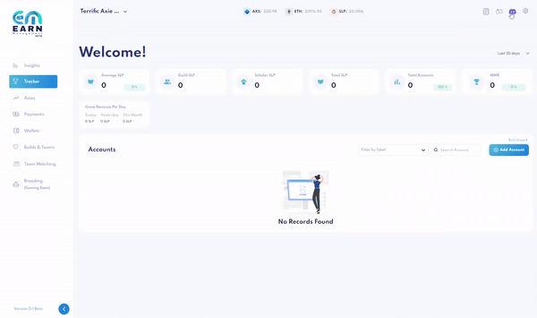
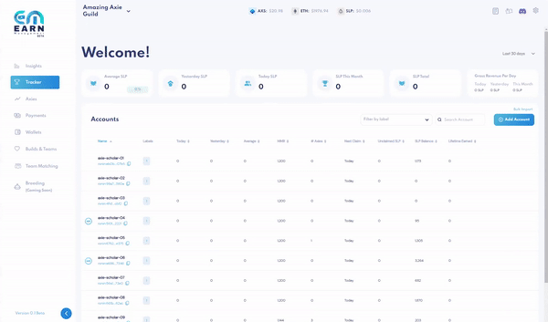
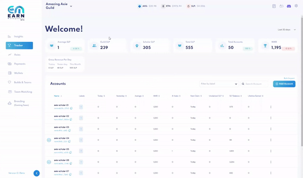

# User Management

**There are 2 types of roles on Earn Alliance:**

1. Admins who have accounts can manage and access all features of the account.
2. Scholars who have accounts can view:
   * Individual activity and performance 
   * Historic payments and breakdowns of how they got paid
   * Note that scholars have **read-only** access to your account; they will only have access to a custom view of the [Tracker](tracker.md), [Payments](payments.md) and [Axie Search](axie-search.md) 

## Invite User
There are 3 ways to invite users.

### Invite Scholar or Trainer via Tracker

Using the [Tracker](tracker.md), you may invite a user while adding/editing an account.

When adding or editing an account, click on "scholar’s payment ronin address" _(this is the account your scholar is paid in)._

**Adjust the toggle** on the right to enter their email address instead. If they do not have an account, an invitation will be sent to their email address.

### Invite Scholar via Guild URL

Every guild account has its own unique invite URL. 

1. Go to the Settings icon _(top right_)
2. In “Manage and Invite Users,” select "Guild Settings"
3. Copy the invite URL 

For security purposes, anyone signing up for or logging in to an Earn Alliance account via the invite URL will join your guild account with **scholar permissions only**. To upgrade them to admin status, you can do so manually under "Manage and Invite Users."

### Invite Admin or Scholar via User Management

Earn Management has a portal for managing users.

1. Go to the Settings icon _(top right_)
2. Select “Manage and Invite Users”

Select “Invite User”

**To invite admins** to create an account via email, enter their:

* Email address
* Permission type: Admin 

**To invite scholars** to create an account via email, enter their:

* Email address
* Permission type: Scholar
* Assigned scholar account (_this must be an account that’s already been added to your [Tracker](tracker.md)_)
  

**All invited users will be sent an invitation link** via email, and be able to sign up for an account on Earn Management.

Scholars will be need to enter their payment ronin address to sign up. Note that if their payment address is already in the system, they **will not** be able to sign up due to duplicate ronin addresses.

## Create New Guild 

With one login email, users can invite and accept invitations to be part of multiple guilds. In addition, they can also **create multiple new guild accounts**. 

1. To create a new guild, select "Creat New Guild" under Settings
3. Simply enter your guild's name
4. Entering the treasury ronin wallet and wallet alias is optional, but note will be mandatory to perform any payment-related actions.

### Multiple Guild Accounts 

Easily switch between guild accounts at the top left of your dashboard. If you have different roles in the guild accounts of which you are a part, those account permissions will be reflected accordingly. 

