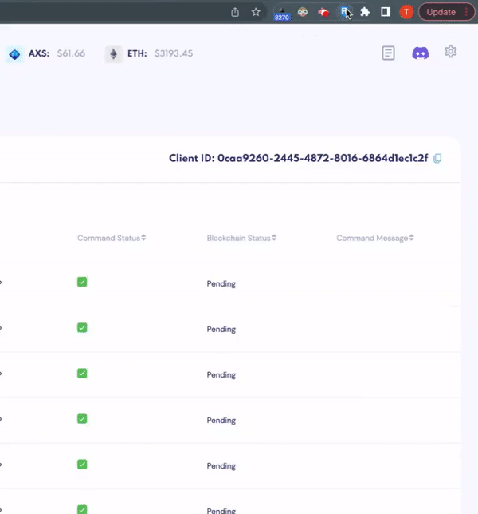
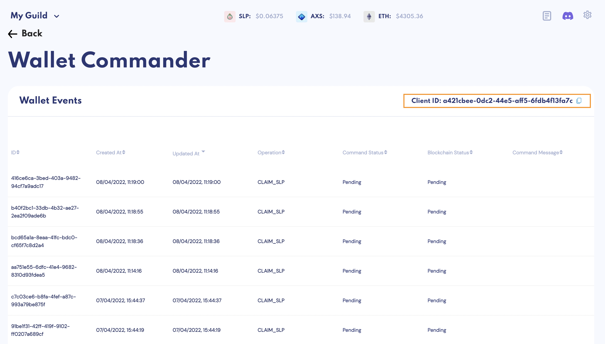
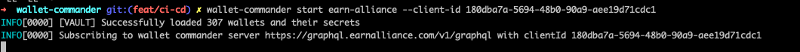
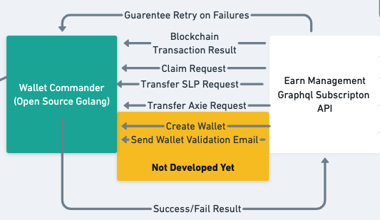

# Wallet Commander

The Wallet Commander is an open-source utility used for **signing blockchain operations for Earn Alliance**.

For blockchains like Axie Infinity's Ronin Network, it is not possible to deploy smart contracts to execute complex operations in a decentralized fashion. 

Earn Alliance does not wish to and **will never take custody of your private keys**. We developed the Wallet Commander to run on your machine and automatically process operations that you have requested on Earn Alliance.

The owner of the wallet(s) that are being managed by a third-party, such as Earn Alliance, can **register private keys with specific permissions on what the third-party is allowed to do with them**.

The tool will be open-source so that the code can be audited for safety and security. View the code [here](https://github.com/earn-alliance/wallet-commander-cli/). 

## Current Status

The Wallet Commander is currently in **alpha** status. Currently there is no whitelist protection of ensuring wallet commands are transferring assets amongst wallets you have approved. We are aiming to quickly get the Wallet Commander to beta status with improved security.


## Getting Started

First, install the `wallet-commander` on your computer. Depending on the machine you’re using, follow the correct installation instructions below. 


### Installation

#### Windows
Ensure you have the following requirements on your Windows machine:

Windows 7 SP1+ / Windows Server 2008+
PowerShell 5 (or later, include PowerShell Core)

Start powershell as an administrator and run the following command to install the `wallet-commander` to your PATH.

```
Set-ExecutionPolicy -ExecutionPolicy RemoteSigned -Scope CurrentUser

Invoke-Expression (New-Object System.Net.WebClient).DownloadString('https://raw.githubusercontent.com/earn-alliance/wallet-commander-cli/main/install.ps1')
```

Once completed, you may open up a new Powershell command prompt and then run the `wallet-commander help` command to confirm it has been installed successfully.


#### Mac
Install the `wallet-commander` on your machine by running the following commands.

```
curl -L https://raw.githubusercontent.com/earn-alliance/wallet-commander-cli/main/install.sh | bash
```
Restart the terminal and then run the `wallet-commander help` command to confirm it has been installed successfully.


#### Linux
Run the following commands – which will ensure you have unzip installed – and install the `wallet-commander` to your path:

```
sudo apt-get install -y unzip
curl -L https://raw.githubusercontent.com/earn-alliance/wallet-commander-cli/main/install.sh | bash
```

Restart the terminal and then run the `wallet-commander help` command to confirm it has been installed successfully.


### Process Remote Commands
Processing remote commands allows you to sign requests for Earn Alliance. 

First, you need to set up your private keys. Then, you can run the `wallet-commander`.


#### Set Up Private Keys
To start signing remote commands such as Payments, Claims and Distribution of Accounts, you will need to first set up your `secrets.json` file, which is a json map of a `{ronin-address}:{private-key}`. 

To find your private key:
1. Go to your ronin account
2. Click Manage at the top right
3. Find the wallet
4. View private key



Your `secrets.json` file will look like this:


```.json
{
   "ronin:ab673081b96b53ed7de9f87c5256212c2dbc016e":"0x4e2148146b276353252532b038c732e2fc",
   "ronin:966d60933325252532969e1b5aasfafafafdsfafsd": "0x8643bb38c2e753252527e308022a3",
   "ronin:f3392d399d67cfaa6094e202d21139cab65f3cb0":"0xfda4fe502532525252c0327931fdbe2ed4946"
}
```

Ensure the file is named `secrets.json` and is stored in the same folder from which the command is run.


#### Start the `wallet-commander`
Once your private keys file is ready, you can start the `wallet-commander` to sign operations on your behalf. 

To do this you will need to get your **Client ID** from Earn Alliance.

Click the Settings icon at the top right of your account and go to the Wallet Commander. 

At the top right, you will find your **Client ID**. 



Copy that and run the following command in your terminal.

```
wallet-commander start earn-alliance -–client-id [enter-client-id-here]
```

If you are successful, you will find the following logs:



#### Usage



When the `wallet-commander` is running, it takes transaction requests from Earn Alliance and signs them with your private keys. The following events may occur when performing operations with Earn Alliance:

* [Ronin Claims](payments.md#start-payments) - When processing a PENDING_CLAIM event from a Payment Event, the Wallet Commander will sign and request claims on your behalf
* [SLP Transfers](payments.md#start-payments) - When transferring SLP, the Wallet Commander will sign transfer requests to execute a Payment Event
* Axie Transfers - When distributing Axies with [Team Matchmaking](builds-and-teams.md#team-templates), the Wallet Commander will sign transfers of Axie assets

In the future, the following operations will be added:

* AXS Claims and Transfers - Ability to transfer AXS and claim winnings
* RON Transfers - Automatically transfer RON to accounts in need
* Account Creation and Validation - Automatically create new ronin wallets and validate their emails


