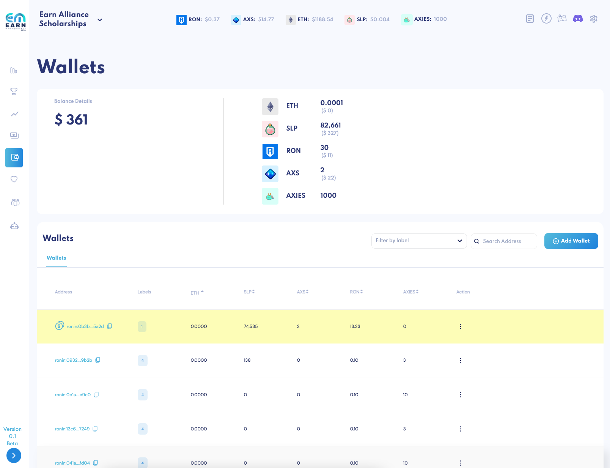

# Wallets

Wallets give you an overview of **all your assets** (in ETH, SLP, AXS, RON and Axies) across all wallets associated with your scholarship.

Scroll down and you’ll be able to see and sort by how much each wallet contains.

**Add Wallet** by clicking the button on the right. Enter:

* Name
* Ronin address
* Label(s)

The highlighted wallet is your **designated treasury wallet** – this is the wallet that receives the guild share when [payments](payments.md) are processed. This wallet will appear in the first row no matter what filters and sorting functions are in place. Set any wallet as the treasury from the action menu on the right.

Easily **search for wallets** by filtering for labels and/or entering the account name, alias, or ronin address in the search bar. 
