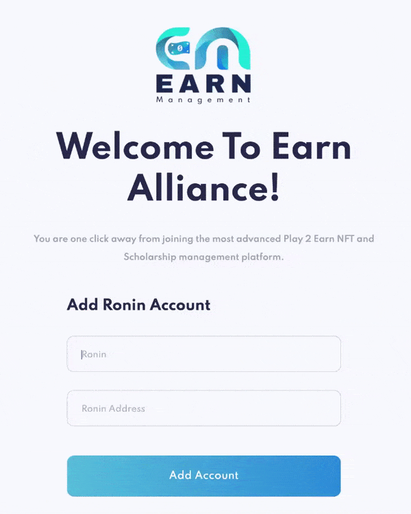
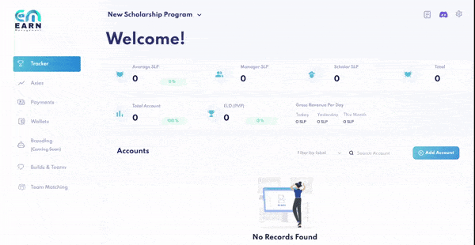

# Getting Started

**Setting up your account and tracking your first ronin wallet takes 2 minutes.**

Here’s how to get started:

1. Head to our [registration page](https://app.earnalliance.com/).

2. Sign up using a valid email address. Or continue with Google or Discord. No additional installation is necessary.

3. If you are a **guild owner or manager** and setting up an account for your guild, enter your account name and **treasury** ronin wallet address.

4. That’s it! Your Earn Management scholarship automation account is all set up.

5. You’ll arrive at the Tracker page, where you can choose to add an account.

 

6. **Add each scholar’s account** by filling in the following information:

* Account name (i.e. scholar-01)
* Ronin address (this is the account your scholar plays on)
* Scholar’s % revenue share

After entering your scholar’s %, the manager’s % revenue share will be automatically updated to equal 100%.

7. Once you’re done, click “Add Account” at the bottom to save.

**Congratulations, you’re tracking your first account!**

To use our Payments feature, you’ll fill in additional (and optional) fields, such as the 
scholar’s payment ronin address – the detailed instructions for which you’ll find in the
[Add Account](../features/tracker.md#add-account) section below.

So, ready to do some high-level tracking?
